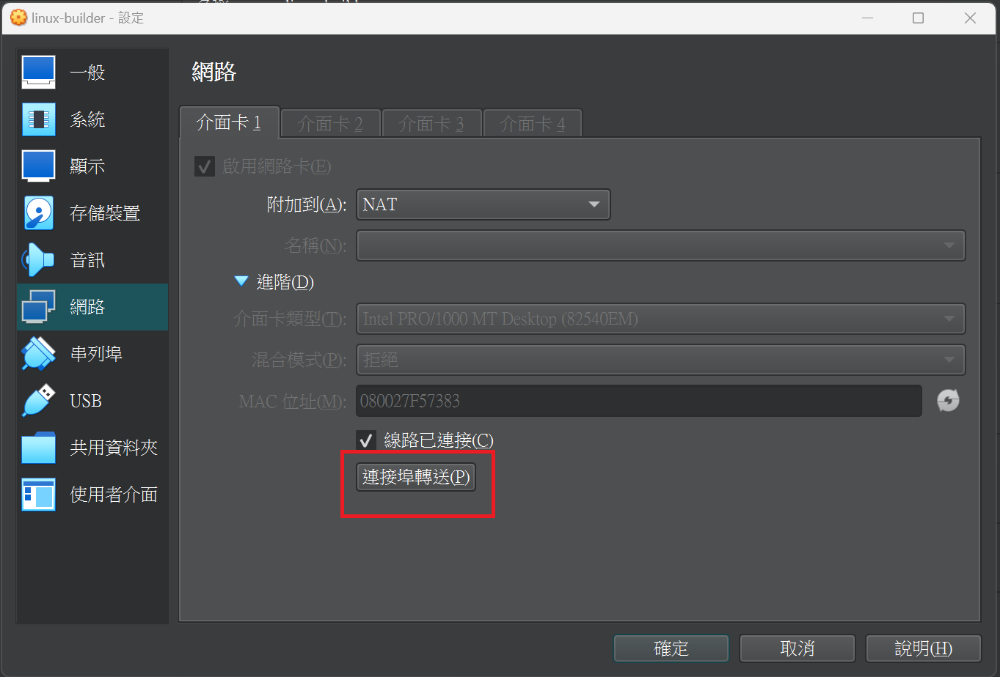
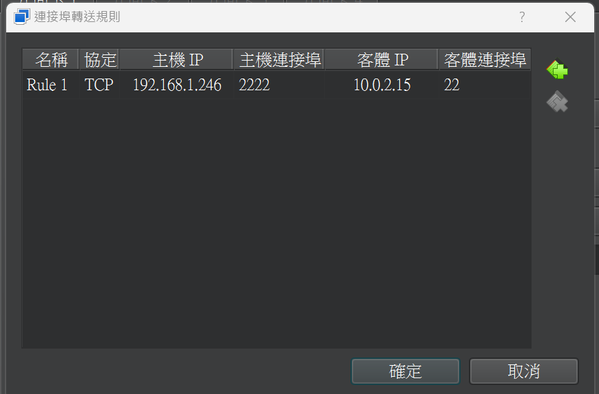

# 前言
為了讓windows能ssh到VM，所以才設定port forward  
因為是NAT，VM是將網卡當作出入口，所以在設定上對自己的網卡特定port發送封包，相對應的VM port就可以拿到封包 

# 操作流程
- 
- 設定
    - "主機IP":為主機(windows)網卡的IP
    - "主機連接埠":為指定的port，只要沒有用到的port就好
    - "客體IP":VM的IP
    - "客體連接埠":22(ssh port)
    

# REF
- https://www.kjnotes.com/devtools/77